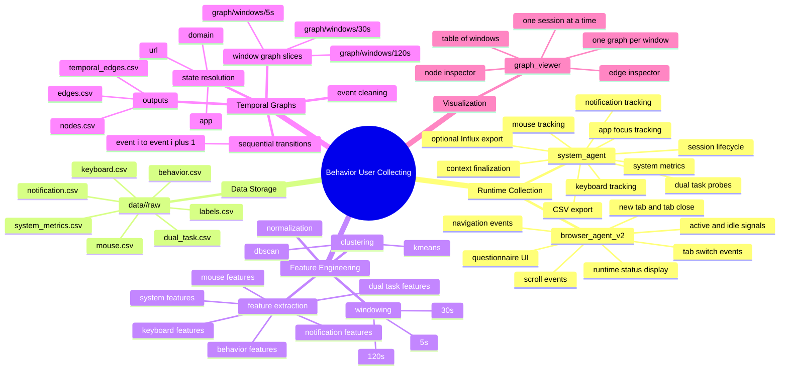
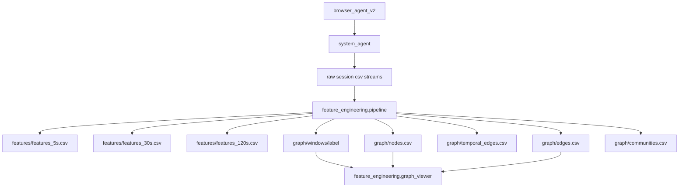

# Architecture

This document describes the full project architecture, from runtime collection to temporal graph visualization.

## System Mindmap



## High-Level Flow



## Project Structure

```text
Behavior User Collecting/
|- README.md
|- Architecture.md
`- cognitive_system/
   |- HOW_TO_RUN.md
   |- README.md
   |- requirements.txt
   |- setup.py
   |- data/
   |- browser_agent_v2/
   |- feature_engineering/
   `- system_agent/
```

## Component Responsibilities

### 1. `system_agent/`

The system agent is the runtime orchestrator.

It is responsible for:

- starting and ending sessions
- tracking the foreground app on Windows and Linux when desktop metadata is available
- maintaining the active context state machine
- finalizing context intervals into `behavior.csv`
- writing all raw CSV streams
- coordinating browser recording
- running dual-task probes and questionnaire flow

Key modules:

- `main.py`
- `context_tracker.py`
- `data_writer.py`
- `app_tracker.py`
- `keyboard_tracker.py`
- `mouse_tracker.py`
- `system_metrics.py`
- `notification_tracker.py`

### 2. `browser_agent_v2/`

The browser extension is a controlled browser-side collector.

It is responsible for:

- detecting navigation, tab switching, tab creation, and tab closing
- sending scroll and active/idle events
- receiving session state from the system agent
- presenting questionnaire and runtime UI

### 3. `feature_engineering/`

This package transforms a raw session into analysis artifacts.

Subsystems:

- `windowing.py`
  - generates session windows
- `features.py`
  - computes per-window multimodal features
- `graph_builder.py`
  - builds the corrected temporal graph from sequential events
- `clustering.py`
  - clusters windows into cognitive states
- `pipeline.py`
  - orchestrates the full raw-to-analysis workflow
- `graph_viewer.py`
  - visual inspection GUI for one session as a window table

## Correct Temporal Graph Model

The critical graph design rule is:

- graph edges come from event order, not window order

Formal view:

```text
G = {(u, v, t)}
u = source state
v = next state
t = transition timestamp
```

Implementation meaning:

1. load and clean `behavior.csv`
2. keep valid transition-bearing events
3. sort events by ascending timestamp
4. resolve each event to a node at `app`, `domain`, or `url` level
5. create transitions from consecutive events:
   - `event[i] -> event[i+1]`
6. aggregate edge weights

### What Is Not Allowed

These are invalid graph nodes or edges:

- `window_id` as a graph node
- `w000001 -> w000002` as graph edges
- window similarity edges used as the behavioral graph backbone

## Session Artifacts

### Raw layer

```text
data/<session_id>/raw/
```

Contains runtime event logs written by the agent.

### Feature layer

```text
data/<session_id>/features/
```

Contains normalized feature tables for each supported window size.

### Graph layer

```text
data/<session_id>/graph/
|- nodes.csv
|- edges.csv
|- temporal_edges.csv
|- communities.csv
`- windows/
```

Meaning:

- `nodes.csv`
  - state inventory for the session graph
- `edges.csv`
  - aggregated transition statistics
- `temporal_edges.csv`
  - one row per transition event
- `graph/windows/<label>/`
  - per-window graph slices built with the same event-transition logic

## Visualization Layer

`feature_engineering.graph_viewer` is designed for qualitative inspection.

It shows:

- one session at a time
- windows arranged as a table
- one graph inside each window cell
- a side inspector that reveals node and edge features when clicked

The current viewer can already display:

- app nodes
- tab nodes based on domain or URL
- app-to-app edges
- tab-to-tab edges
- app-to-tab edges

Some fields are heuristic or placeholders until the upstream pipeline computes them fully.

## Recommended Workflow

1. Collect a session with `system_agent/main.py`
2. Confirm raw CSVs exist under `data/<session_id>/raw/`
3. Run `python -m feature_engineering.pipeline <session_id>`
4. Validate `graph/nodes.csv`, `graph/edges.csv`, and `graph/temporal_edges.csv`
5. Open `python -m feature_engineering.graph_viewer --session-id <session_id>`

## Related Docs

- Overview: [README.md](README.md)
- Runtime and module notes: [cognitive_system/README.md](cognitive_system/README.md)
- Run instructions: [cognitive_system/HOW_TO_RUN.md](cognitive_system/HOW_TO_RUN.md)
